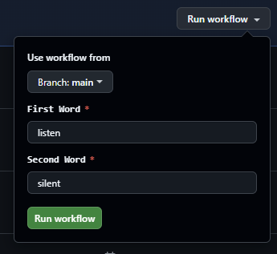

# Anagram CI Validator

A robust, lightweight TypeScript utility that determines if two strings are anagrams. This project demonstrates a complete modern DevOps workflow using **TypeScript**, **Jest**, and **GitHub Actions** for automated testing and manual validation.

## 🚀 Features

### Core Functionality
The `isAnagram` function checks if two strings share the same characters with the same frequencies ($O(n)$ complexity). It supports advanced configuration options:
* **Case Sensitivity:** By default strict, but can ignore case.
* **Whitespace Handling:** Can optionally ignore spaces/tabs.
* **Unicode Normalization:** Correctly handles accents and combined characters (e.g., `ñ` vs `n` + `~`).

### CI/CD Infrastructure
* **Automated Testing:** Runs the full test suite on every `push` and `pull_request` to `main`.
* **Manual Validation:** A custom GitHub Action workflow that allows you to input two words manually via the GitHub UI and see the result instantly in the build logs.


---

## 🛠️ Getting Started

### Prerequisites
* Node.js (v18 or higher)
* npm

### Installation

1.  Clone the repository:
    ```bash
    git clone [https://github.com/YOUR_USERNAME/anagram-ci-validator.git](https://github.com/YOUR_USERNAME/anagram-ci-validator.git)
    cd anagram-ci-validator
    ```

2.  Install dependencies:
    ```bash
    npm ci
    ```

---

## 💻 Usage

### In Code
You can import the utility directly into your TypeScript project:

```typescript
import { isAnagram } from './src/anagram';

// Basic Usage
console.log(isAnagram('listen', 'silent')); // true

// With Options
const options = { 
    ignoreCase: true, 
    ignoreWhitespace: true 
};

console.log(isAnagram('Clint Eastwood', 'old west action', options)); // true